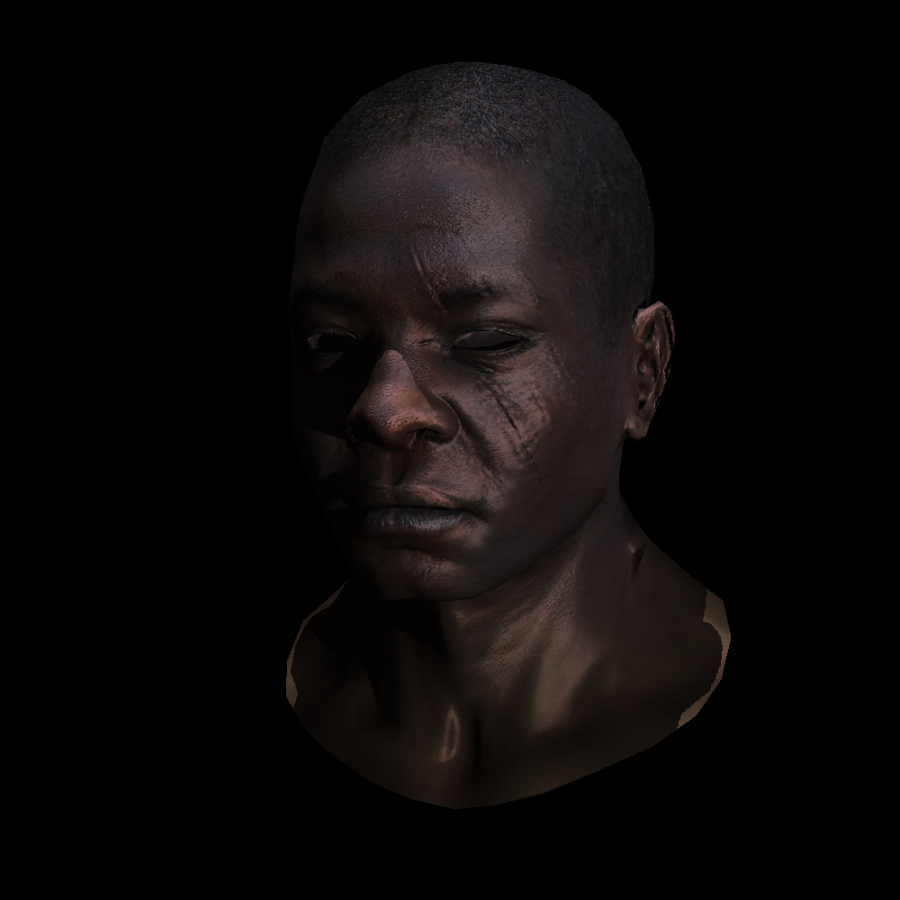
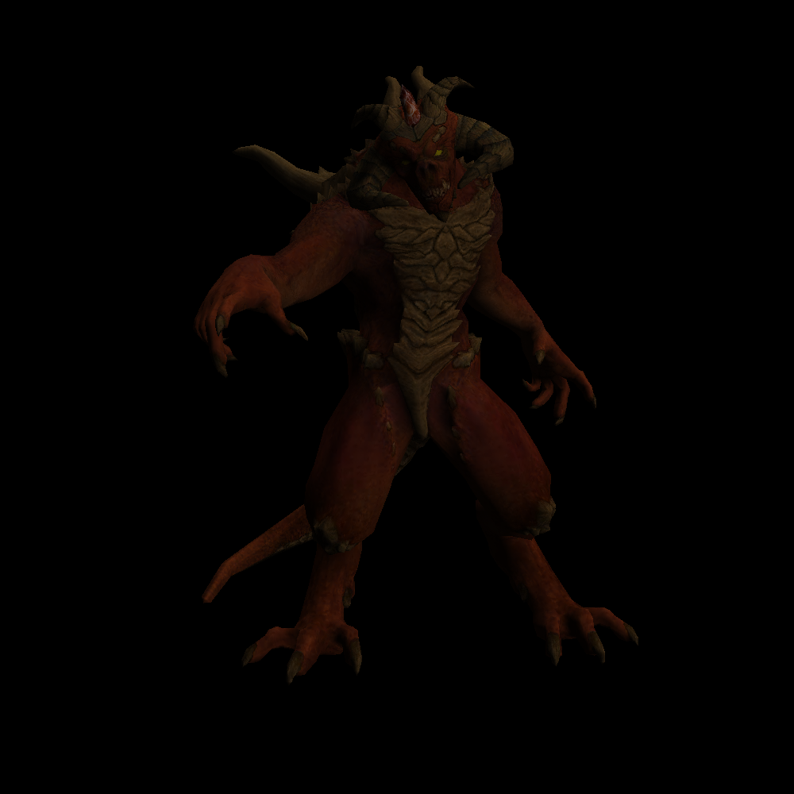
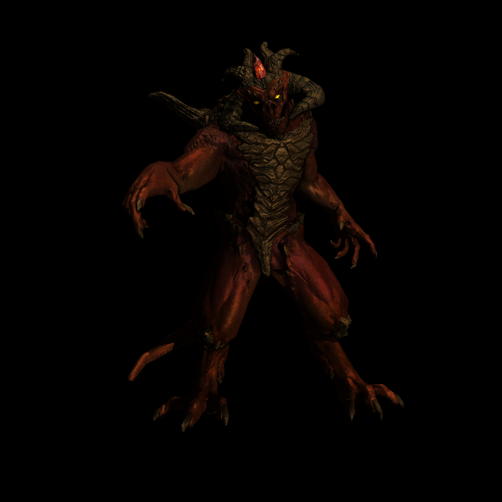
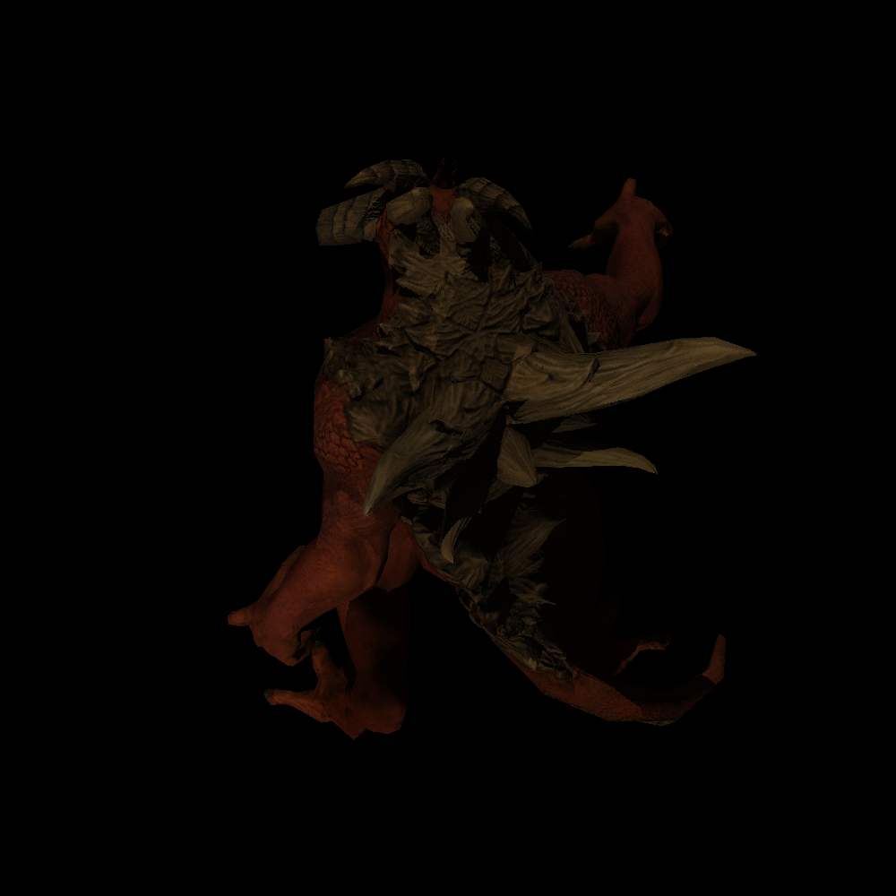
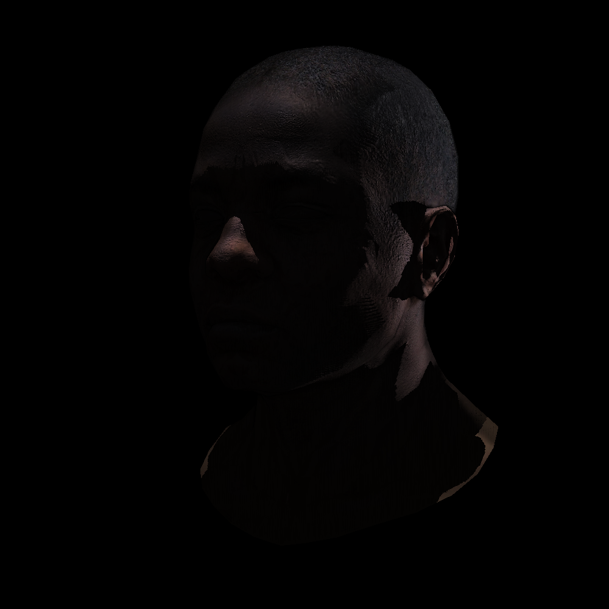
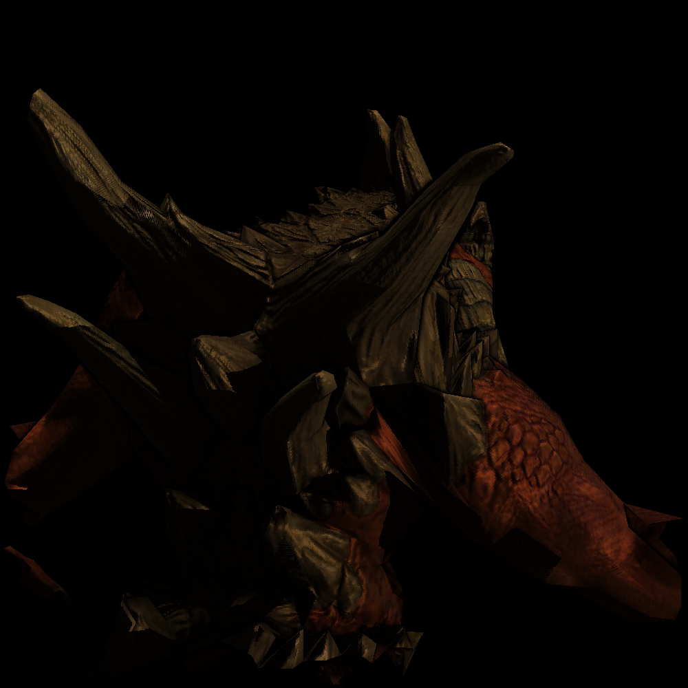
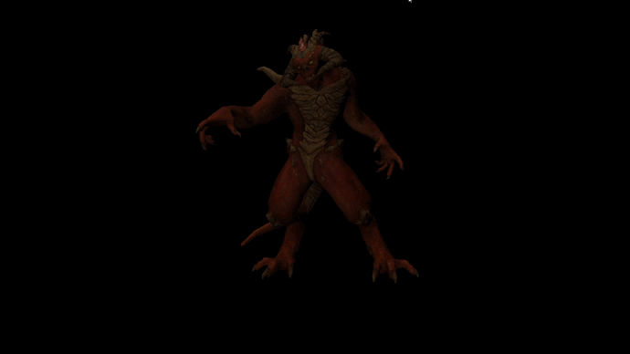

# renderust

OpenGL-like renderer written from scratch in Rust.  
Based on this guide: [tinyrenderer](https://github.com/ssloy/tinyrenderer/wiki/Lesson-0:-getting-started). 

Triangle rasterization is done using [scanline method](https://en.wikipedia.org/wiki/Scanline_rendering). 

### Controls

    [1] — toggle normal map
    [2] — toggle specular light
    [3] — toggle glow map
    [4] — toggle self shadow
    [5] — toggle ambient occlusion
    [R] — toggle light spin

    [WASD / Space / Shift] — move model
    [LMB] — rotate model
    [Scroll] — zoom camera

    [Ctrl+S] — save image (to ./output.bmp)

## Demo

 
Diablo

Without effects  
  
With effects (normal maps, specular light, self shadowing, glow map, ambient occlusion)  
  
Self shadows from two lights (which are directed top-down and back-forward)  

 
More pictures

 

 
Video

